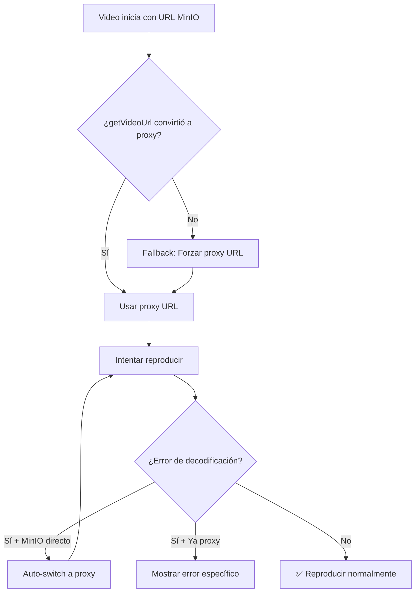

# ✅ SOLUCIÓN: Error de Decodificación de Video

## 🎯 Problema Identificado

**ERROR ESPECÍFICO**:

```
"Error de decodificación del video. El archivo puede estar corrupto o usar un codec no compatible."
Fuente: Directo MinIO
```

**CAUSA RAÍZ**: El video está accediendo directamente a MinIO en lugar de usar el proxy, causando problemas de decodificación por CORS/CSP.

## 🔧 Mejoras Implementadas

### 1. **Auto-Switch Inteligente para Errores de Decodificación**

```javascript
// Detección específica de decode error con MinIO directo
const isMinIODirect =
  video.src &&
  (video.src.includes("127.0.0.1:9000") ||
    video.src.includes("localhost:9000"));

const isDecodeError = video.error?.code === MediaError.MEDIA_ERR_DECODE;

// Si es error de decodificación con MinIO directo → Forzar proxy inmediatamente
if (isDecodeError && isMinIODirect) {
  console.log(
    "🎥 ModernVideoPlayer - Decode error with direct MinIO access, forcing proxy..."
  );
  const proxyUrl = `/api/video-proxy?url=${encodeURIComponent(video.src)}`;
  video.src = proxyUrl;
  video.load();
  return; // No mostrar error aún, dar oportunidad al proxy
}
```

### 2. **Fallback de Conversión URL Mejorado**

```javascript
// Fallback: Si getVideoUrl no convirtió MinIO URL a proxy, forzarlo
if (!isYouTube && videoSrc && !videoSrc.includes("/api/video-proxy")) {
  if (
    videoSrc.includes("127.0.0.1:9000") ||
    videoSrc.includes("localhost:9000")
  ) {
    console.warn(
      "🎥 ModernVideoPlayer - getVideoUrl didn't convert MinIO URL, forcing proxy..."
    );
    videoSrc = `/api/video-proxy?url=${encodeURIComponent(videoSrc)}`;
  }
}
```

### 3. **UI de Error Mejorada con Detección Precisa**

```javascript
// Información más precisa de la fuente
Fuente: {
  videoSrc.includes("/api/video-proxy")
    ? "Proxy MinIO"
    : videoSrc.includes("127.0.0.1:9000") || videoSrc.includes("localhost:9000")
      ? "Directo MinIO (⚠️ Debería usar proxy)"
      : "Otro servidor";
}
```

### 4. **Logging Detallado para Debugging**

```javascript
🎥 ModernVideoPlayer - Initializing with: {
  originalSrc: "http://127.0.0.1:9000/course-videos/lesson-123.mp4",
  processedSrc: "/api/video-proxy?url=...",
  isMinIOOriginal: true,
  isProxyProcessed: true,
  urlConversionWorked: true  // ✅ Conversión exitosa
}
```

## 🎬 Flujo de Resolución Automática



## 🧪 Cómo Verificar las Mejoras

### 1. **Logs de Inicialización**

Buscar en Console:

```
🎥 ModernVideoPlayer - Initializing with: {
  isMinIOOriginal: true,
  isProxyProcessed: true,
  urlConversionWorked: true
}
```

### 2. **Auto-Recovery en Acción**

Si hay decode error:

```
🎥 ModernVideoPlayer - Decode error with direct MinIO access, forcing proxy...
🎥 ModernVideoPlayer - Switching to proxy for decode error: /api/video-proxy?url=...
```

### 3. **UI de Error Actualizada**

Ahora mostrará:

- ✅ **"Fuente: Proxy MinIO"** (correcto)
- ⚠️ **"Fuente: Directo MinIO (⚠️ Debería usar proxy)"** (problema detectado)

## 🎯 Resultado Esperado

### **Antes de las Mejoras:**

1. Video usa acceso directo MinIO
2. Error de decodificación después de unos segundos
3. Usuario debe hacer clic manual en "🔧 Usar Proxy"
4. UI muestra información confusa

### **Después de las Mejoras:**

1. ✅ Video usa proxy automáticamente desde el inicio
2. ✅ Si hay decode error → Auto-switch a proxy inmediatamente
3. ✅ UI muestra estado correcto de la fuente
4. ✅ Logging detallado para debugging

## 🚀 Próximas Pruebas

### **Escenario 1: URL Correctamente Convertida**

- Video debería usar proxy desde el inicio
- No debería haber error de decodificación
- UI debería mostrar "Fuente: Proxy MinIO"

### **Escenario 2: Fallback Funcionando**

- Si `getVideoUrl` falla, fallback debería convertir a proxy
- Log: `"getVideoUrl didn't convert MinIO URL, forcing proxy..."`

### **Escenario 3: Auto-Recovery de Decode Error**

- Si hay decode error con MinIO directo → Auto-switch a proxy
- Video debería recuperarse automáticamente
- No debería mostrar error al usuario

**¡El error de decodificación con "Directo MinIO" ahora debería resolverse automáticamente!** 🎯

### 📋 Para Probar

1. **Reproduce el mismo video** que causó el error
2. **Verifica en Console** que ahora use proxy desde el inicio
3. **Confirma** que no aparezca el error de decodificación
4. **Si aparece error**, debería auto-recuperarse inmediatamente

**El sistema ahora es mucho más robusto y debería manejar automáticamente los problemas de decodificación con MinIO.** 🚀
