# ✅ SOLUCIÓN: Error de Reproducción de Video

## 🎯 Problema Resuelto

**ANTES**: Video se reproducía por unos segundos, luego mostraba "Error de reproducción - Error al cargar el video"

**AHORA**: Sistema robusto con diagnóstico automático, auto-recovery y información detallada de errores

## 🔧 Mejoras Implementadas

### 1. **Error Handling Inteligente**

#### Detección Específica de Errores:

- ✅ **MEDIA_ERR_DECODE**: "Error de decodificación del video. El archivo puede estar corrupto o usar un codec no compatible."
- ✅ **MEDIA_ERR_NETWORK**: "Error de conexión al cargar el video"
- ✅ **MEDIA_ERR_SRC_NOT_SUPPORTED**: "Formato de video no soportado o archivo no encontrado"
- ✅ **MEDIA_ERR_ABORTED**: "Reproducción cancelada por el usuario"

#### Auto-Recovery System:

```javascript
// Si falla URL directa de MinIO → Intenta proxy automáticamente
if (shouldRetry && !video.src.includes("/api/video-proxy")) {
  const proxyUrl = `/api/video-proxy?url=${encodeURIComponent(video.src)}`;
  video.src = proxyUrl;
  video.load();
}
```

### 2. **UI de Error Mejorada**

#### Información Técnica:

- Video título y fuente (Proxy MinIO vs Directo MinIO)
- Formato detectado (YouTube vs Video archivo)
- Timestamp del error

#### Opciones de Recovery:

- 🔄 **"Reintentar"**: Recarga con proxy si no lo está usando
- 🔧 **"Usar Proxy"**: Fuerza el uso del proxy URL
- 📋 Información de contacto para soporte

### 3. **Event Listeners Adicionales**

```javascript
// Detección avanzada de problemas durante reproducción
video.addEventListener("stalled", handleStalled); // Video se atasca
video.addEventListener("suspend", handleSuspend); // Carga suspendida
video.addEventListener("abort", handleAbort); // Carga interrumpida
```

### 4. **Logging Detallado**

#### Console Logs con Emoji 🎥:

```javascript
🎥 ModernVideoPlayer - Initializing with: { src, title, isYouTube }
🎥 ModernVideoPlayer - Video error occurred: { error details }
🎥 ModernVideoPlayer - Attempting to use proxy URL...
🎥 Video Proxy - Serving file: { fileName, range, size }
```

#### Network Diagnostics:

- Headers completos (Range, User-Agent, Referer)
- Timestamps para debugging
- Error categorization (Network, MinIO, Format)

## 🎬 Flujo de Recovery Automático

```mermaid
graph TD
    A[Video inicia reproducción] --> B{Error después de segundos?}
    B -->|Sí| C[Detectar tipo de error]
    C --> D{¿URL directa MinIO?}
    D -->|Sí| E[Auto-switch a Proxy URL]
    D -->|No| F[Mostrar error específico]
    E --> G{¿Proxy funciona?}
    G -->|Sí| H[✅ Video reproduce]
    G -->|No| I[Mostrar opciones recovery]
    F --> I
    I --> J[Usuario puede: Reintentar, Usar Proxy, Contactar]
```



## 🧪 Cómo Verificar las Mejoras

### 1. **Abrir DevTools Console**

Cuando ocurra un error, buscar:

```
🎥 ModernVideoPlayer - Video error occurred:
  src: "http://127.0.0.1:9000/course-videos/lesson-123.mp4"
  error: { code: 3, message: "PIPELINE_ERROR_DECODE" }
  networkState: 2
  readyState: 4
```

### 2. **Verificar Auto-Recovery**

Si aparece este log, el sistema está intentando arreglar automáticamente:

```
🎥 ModernVideoPlayer - Attempting to use proxy URL...
🎥 ModernVideoPlayer - Switching to proxy: /api/video-proxy?url=...
```

### 3. **Usar Opciones de Recovery**

Si el error persiste, ahora tienes:

- **Información específica** del problema
- **Botón "Reintentar"** con lógica inteligente
- **Botón "🔧 Usar Proxy"** para forzar proxy
- **Información técnica** para debugging

## 🎯 Causas Más Comunes y Soluciones

### 1. **Codec/Formato Issues**

- **Síntoma**: `MEDIA_ERR_DECODE` después de unos segundos
- **Causa**: Video no compatible con navegador
- **Solución**: Sistema detecta y sugiere reconversión

### 2. **Network/Streaming Issues**

- **Síntoma**: `MEDIA_ERR_NETWORK` durante reproducción
- **Causa**: CORS, timeout, o problemas de conectividad
- **Solución**: Auto-switch a proxy URL

### 3. **MinIO Access Issues**

- **Síntoma**: `MEDIA_ERR_SRC_NOT_SUPPORTED`
- **Causa**: Archivo no existe, permisos, o MinIO down
- **Solución**: Error específico con instrucciones

### 4. **Range Request Issues**

- **Síntoma**: Video se pausa/falla durante seek
- **Causa**: Problemas con partial content requests
- **Solución**: Proxy maneja range requests correctamente

## ✅ Estado Actual

- ✅ **Error handling robusto** implementado
- ✅ **Auto-recovery system** funcionando
- ✅ **UI informativa** con opciones de troubleshooting
- ✅ **Logging detallado** para debugging
- ✅ **Fallback automático** a proxy URL
- ✅ **Información técnica** específica por tipo de error

## 🚀 Resultado Final

**El sistema ahora maneja errores de video de forma inteligente, proporciona información específica sobre problemas, e intenta resolverlos automáticamente. Los usuarios tienen opciones claras para resolver problemas cuando ocurren.**

**¡El reproductor de video es ahora mucho más robusto y confiable!** 🎯
