# ✅ SOLUCIÓN COMPLETA: Subida de Videos a MinIO

## 🎯 Problema Resuelto

**ANTES**: Solo se podían poner enlaces de YouTube  
**AHORA**: Se pueden subir archivos de video que se guardan en MinIO y se reproducen después

## 🚀 Sistema Implementado

### 1. **Interfaz de Subida Moderna**

- Botón "Crear Lección con Video" en la página de administración
- Modal drag-and-drop para seleccionar archivos
- Soporte para MP4, WebM, MOV, AVI (máximo 500MB)
- Conversión automática a MP4 si es necesario
- Progress bar en tiempo real durante la subida

### 2. **Backend de Almacenamiento**

- API endpoint: `/api/lesson/with-video`
- Subida directa a MinIO bucket `course-videos`
- Generación de nombres únicos: `lesson-[timestamp]-[random].mp4`
- Validación de archivos y metadata apropiada
- URLs de MinIO guardadas en base de datos

### 3. **Reproductor Avanzado**

- `ModernVideoPlayer` con controles estilo Netflix
- Streaming desde MinIO via `/api/video-proxy`
- Soporte para range requests (streaming optimizado)
- Controles: play/pause, volumen, velocidad, fullscreen
- Auto-completado de lecciones al terminar video

## 📂 Ubicación de Archivos

```
MinIO Storage:
├── bucket: course-videos/
│   ├── lesson-1640995200000-abc123.mp4
│   ├── lesson-1640995300000-def456.mp4
│   └── lesson-1640995400000-ghi789.mp4

Database:
├── Lesson.videoUrl = "http://127.0.0.1:9000/course-videos/lesson-1640995200000-abc123.mp4"
```

## 🔧 Cómo Usar

### Para Administradores:

1. Ir a **Admin → Cursos → [Curso] → Módulos → [Módulo] → Lecciones**
2. Click en **"Crear Lección con Video"** (botón azul-morado)
3. Arrastrar archivo de video o hacer click para seleccionar
4. Llenar título, descripción, duración, etc.
5. Click **"Crear Lección"**
6. El video se sube a MinIO automáticamente

### Para Estudiantes:

1. Ir a la página de aprendizaje del curso
2. Seleccionar lección con video del menú lateral
3. El video se reproduce automáticamente desde MinIO
4. Usar controles avanzados del reproductor
5. El progreso se guarda automáticamente

## ✅ Funcionalidades Verificadas

- ✅ **Subida de archivos**: Videos se suben a MinIO correctamente
- ✅ **Conversión automática**: Archivos se convierten a MP4 si es necesario
- ✅ **Almacenamiento**: Videos se guardan en bucket MinIO
- ✅ **URLs en DB**: videoUrl apunta correctamente a MinIO
- ✅ **Reproducción**: Videos se reproducen desde MinIO storage
- ✅ **Streaming**: Range requests funcionan para streaming optimizado
- ✅ **Controles**: Reproductor moderno con todas las funciones
- ✅ **Progress tracking**: Progreso de video y lección se guarda
- ✅ **Error handling**: Manejo robusto de errores y reintentos

## 🎬 Flujo Técnico Completo

```mermaid
graph LR
    A[Admin sube video] --> B[Validación]
    B --> C[Conversión MP4]
    C --> D[Upload MinIO]
    D --> E[Guardar URL en DB]
    E --> F[Lección creada]

    F --> G[Student accede]
    G --> H[Load video from MinIO]
    H --> I[ModernVideoPlayer]
    I --> J[Streaming + Controls]
```



## 🔗 Archivos Modificados

1. **`src/app/(dashboard)/admin/courses/[id]/modules/[moduleId]/lessons/page.tsx`**

   - Modal de subida de video implementado
   - Funciones de validación, conversión y upload
   - UI moderna con progress tracking

2. **`src/components/video/ModernVideoPlayer.tsx`**

   - Reproductor avanzado creado desde cero
   - Soporte para MinIO URLs y YouTube
   - Controles profesionales y streaming optimizado

3. **`src/app/(dashboard)/development/courses/[enrollmentId]/learn/page.tsx`**

   - Integración del nuevo reproductor
   - Auto-completado de lecciones
   - Navegación mejorada entre lecciones

4. **Backend APIs existentes** (ya funcionaban):
   - `/api/lesson/with-video` - Subida a MinIO
   - `/api/video-proxy` - Streaming desde MinIO
   - `/api/video-convert` - Conversión de formatos

## 🎯 Resultado Final

**El sistema ahora permite subir archivos de video directamente, los guarda en MinIO, y los reproduce con un reproductor moderno y profesional. Ya no es necesario usar solo enlaces de YouTube.**

**¡El sistema está 100% funcional y listo para usar!** 🚀
